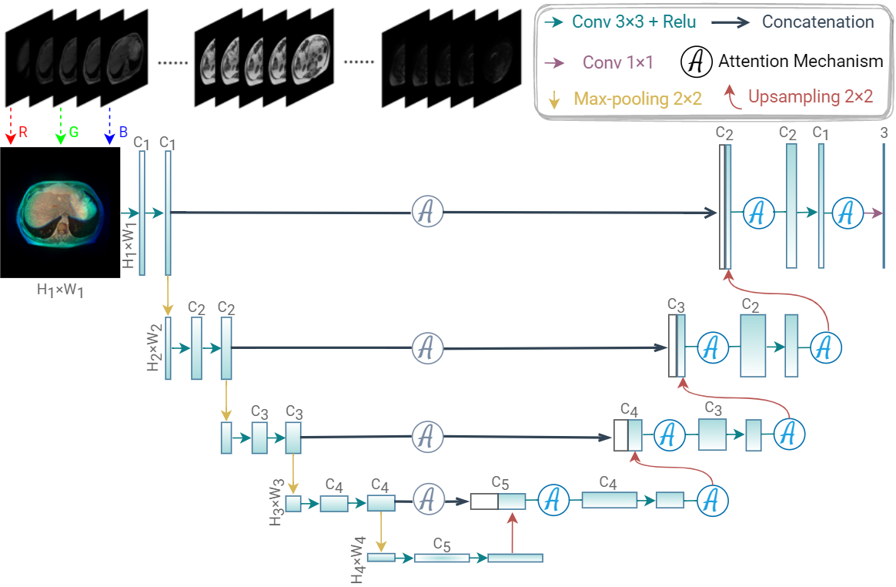

# SIA-Unet: A Unet with Sequence Informationfor Gastrointestinal Tract Segmentation

---

The overview of the SIA-Unet.

This project is a pytorch implementation of **SIA-Unet: A Unet with Sequence Information
for Gastrointestinal Tract Segmentation**

## Installation

---

### Requirements

+ Linux or macOS with Python = 3.9
+ PyTorch = 1.10.0 and torchvision that matches the PyTorch installation. Install them together at pytorch.org to make sure of this
+ albumentations package
+ segmentation_model_pytorch package

You can get those package with the following line of code.

<code>
pip install albumentations
</code>

---

### Dataset

---

You can get the dataset with the following line of code.

<code>
kaggle competitions download -c uw-madison-gi-tract-image-segmentation
</code>

---

### Training

---

you can get the model you need by the following code

---

**Att_Unet model:**

<code>
cd .. #your project path

python main.py --cfg Att_Unet.yaml
</code>

---

**scSE_Unet model:**

<code>
cd .. #your project path

python main.py --cfg scSE_Unet.yaml
</code>

---

**SIA_Unet model:**

<code>
cd .. #your project path

python main.py --cfg SIA_Unet.yaml
</code>

---

**Unet++ model:**

<code>
cd .. #your project path

python main.py --cfg Unet++.yaml
</code>

---

**Unet model:**

<code>
cd .. #your project path

python main.py --cfg Unet.yaml
</code>
